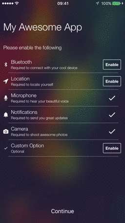
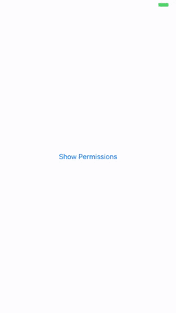
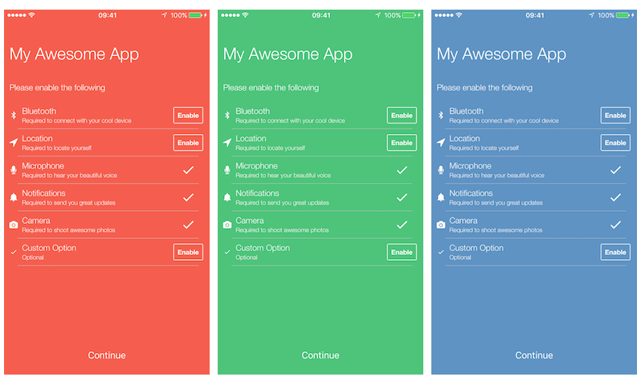
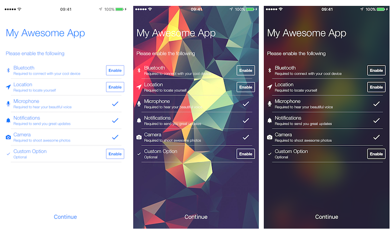

#PAPermissions

PAPermissions is a fully customizable and ready-to-run library to handle permissions through a ViewController

Right now it supports out of the box permissions for:

- Address Book
- Bluetooth
- Calendar
- Camera
- Contacts
- Events
- Location
- Microphone
- Motion Fitness
- Notifications
- Reminders
- Custom




## Compatibility

PAPermissions requires iOS8+, compatible with both Swift 3 and Objective-C based projects

If you are looking for the Swift 2 version of it, please check out the [legacy branch](https://github.com/pascalbros/PAPermissions/tree/legacy)

## Installation


### CocoaPods

[CocoaPods](http://cocoapods.org) is a dependency manager for Cocoa projects.

To integrate PAPermissions into your Xcode project using CocoaPods, specify it in your `Podfile`:

```ruby
pod 'PAPermissions'
```

Then, run the following command:

```bash
$ pod install
```

### Manual Installation

Just copy the PAPermissions folder in your project

## Run the Example

Clone the repo, cd into `Example`:

```bash
$ pod install
```

Or open the project (the blue icon) and copy the PAPermissions folder inside.

## Screenshots

It can be used with a plain background color


Or with a background image


## How it works

Create a new UIViewController, inherit from *PAPermissionsViewController* and write:

```
	let microphoneCheck = PAMicrophonePermissionsCheck()
	let cameraCheck = PACameraPermissionsCheck()

	override func viewDidLoad() {
		super.viewDidLoad()
		
		//Custom settings
		self.locationCheck.requestAlwaysAuthorization = true
		
		
		let permissions = [
	          PAPermissionsItem.itemForType(.microphone, reason: "Required to hear your beautiful voice")!,
					  PAPermissionsItem.itemForType(.camera, reason: "Required to shoot awesome photos")!]
		
		let handlers = [
						PAPermissionsType.microphone.rawValue: self.microphoneCheck,
						PAPermissionsType.camera.rawValue: self.cameraCheck]
		self.setupData(permissions, handlers: handlers)

		self.titleText = "My Awesome App"
		self.detailsText = "Please enable the following"
	}
		
```

That's it!

Anyway you no need to import everything, just remove the unnecessary "check" classes and keep the ones you want to use, you will find them in "Checks" folder.


## Contacts

We would love to know if you are using PAPermissions in your app, send an email to <pasquale.ambrosini@gmail.com>

